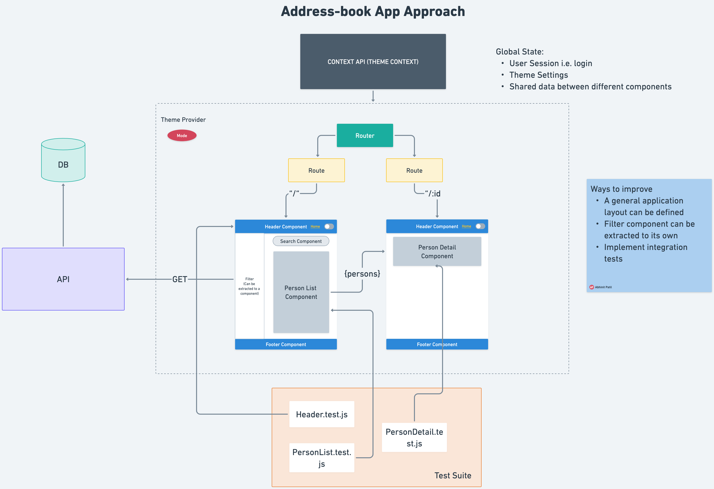

# Getting Started with Address Book App

This project was bootstrapped with the following Technologies and Tools:

1. React JS
2. Axios
3. Tailwind CSS

## To run the project

1. Clone the repository
2. In the project directory, you can run: `npm start`. Runs the app in the development mode.
3. Open [http://localhost:3000](http://localhost:3000) to view it in your browser.
4. You can run `npm test` to run the test suite.

The page will reload when you make changes.

### Project Diagram

### Features

- List of all people retrieved from random user API
- Search feature to find people by name
- Clicking on the on the person card directs user to user details page
- Search people by name
- Filter people by country --> can add more filter options in a similar fashion
- Clean ui using Tailwind

### Further Development

- Given more time, we could make this app into a functional address book manager - connect with any production-grade database to manage contacts
- Add more complex search options i.e. by job, gender, email etc.
- Combine multiple filters
- Reminders for important dates - birthday etc.
- Custom labels/ tags for contacts i.e. work contact, family member, friend etc.

### How to make the project more robust

- More extensive testing - including integration testing, E22 testing
- Encryption of sensitive data
- Performance optimizations
- Analytics and Monitoring
